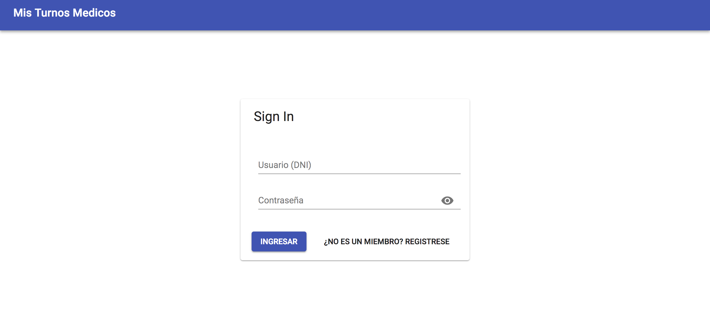
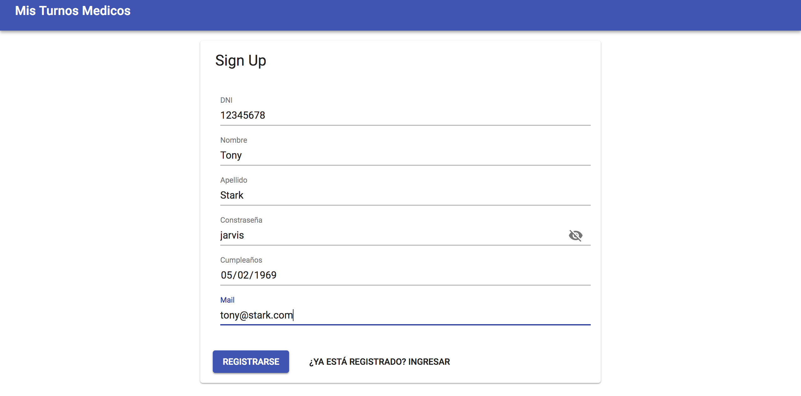
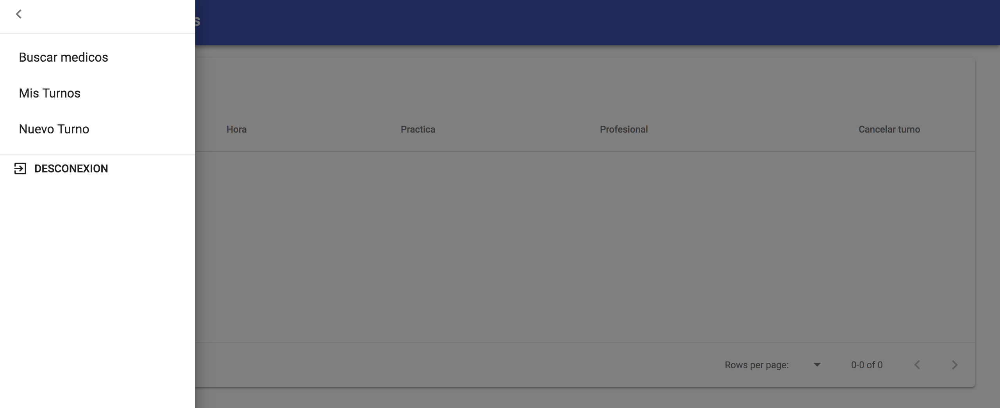
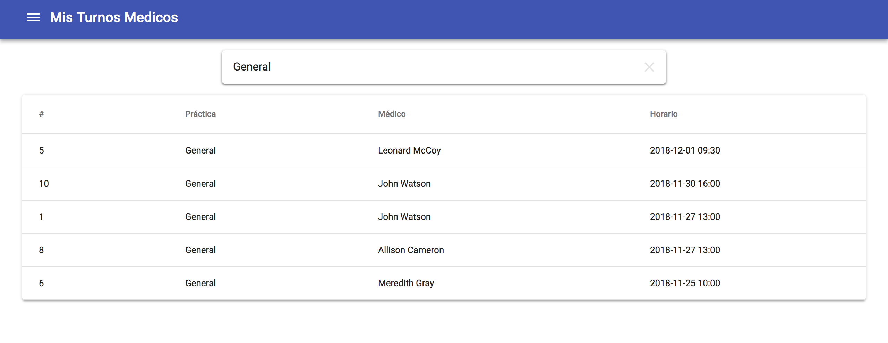
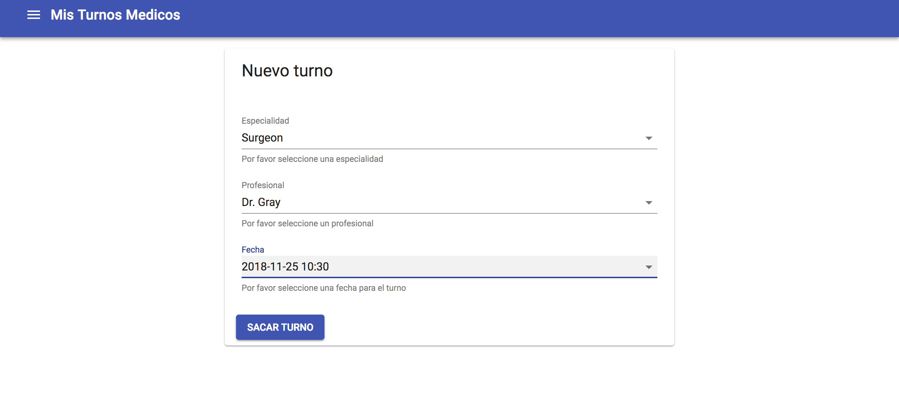
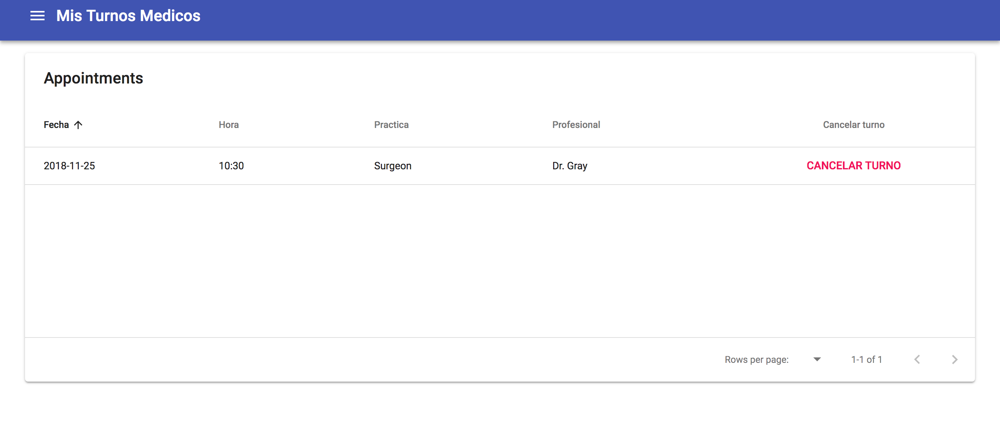
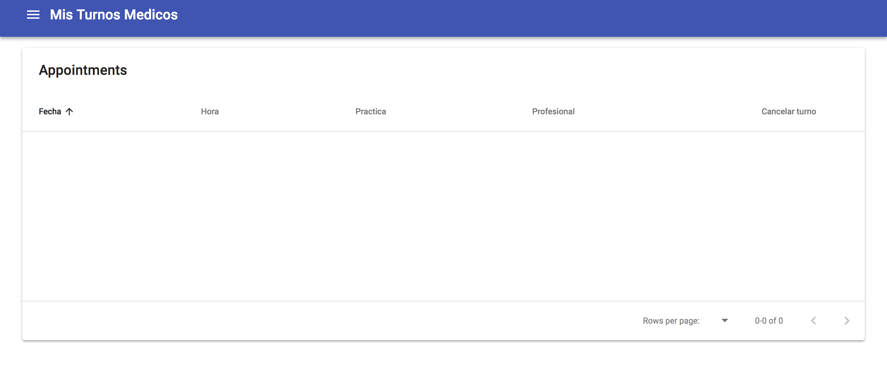

# Mis Turnos Médicos
Trabajo practico grupal de la materia Administración y Control de Proyectos Informáticos 75.44 de la FIUBA.

## Integrantes
* Andrea Caporali
* Carlos Santillán
* María Eugenia Mariotti
* Francisco Ordoñez
* Manuel Porto

---

# Pasos para correr el proyecto

### Dependencias necesarias

* Docker  
    * python
        * sqlite
        * flask
        * gunicorn
    * node
        * react
        * axios
    * nginx
* Docker-compose

### Con Docker y Docker Compose
`docker-compose up --build`

### Sin Docker
Pueden encontrar en los Dockerfiles de `back/` y `front/` las librerías y recursos utilizados.

------

# Manual de Usuario

Apenas entramos al proyecto nos encontramos con la página de login, como no tenemos usuario nos dirigimos a la pantalla de registro.

Llenamos nuestros datos y clickeamos en registrarse.

Como recién nos registramos no tenemos ningún turno asignado.

Hacemos click en el menú lateral ubicado arriba a la izquierda para navegar

En la pantalla de búsqueda podemos ver todos los turnos disponibles que cumplan con cierto parámetro de búsqueda.

Vamos a la pantalla de nuevo turno para reservar uno.

Como nos acabamos de anotar a un turno con la Dr. Gray lo vemos en la pantalla de mis turnos.

Tenemos la posibilidad de borrar el turno por si nos equivocamos, el turno volverá a estar disponible para que otros usuarios lo puedan tomar.

